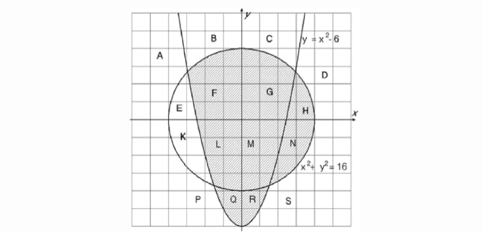

# shootingRangeLavel-8

|Имя входного файла|Имя выходного файла|Ограничение по времени|Ограничение по памяти|
|-|-|
|стандартный ввод|стандартный вывод|2 секунды|64 мегабайта|

Напишите программу, которая определяет, попадает ли заданная точка в заштрихованную область. Границы не входят в область.

### Формат входных данных
Вводится два целых числа X и Y. Каждое из них по модулю не превосходит 105.
### Формат выходных данных
Требуется вывести «1», если координаты точки попадают в данную область, и «0» в противном случае.
### Примеры

|входные данные|выходные данные|
|-|-|
|0 0|1|
|0 5|0|
